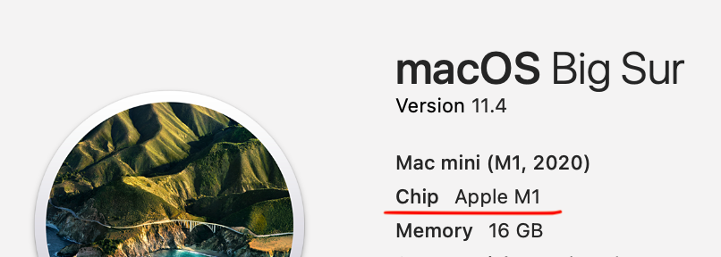

# README

* このrepoはPygame Zeroを使ってPythonを学びながらゲームプログラミングを楽しむためのものです
* 現在以下のコンテンツがあります
  * [ここからはじめよう](./common_py/)
    * 全てのゲームに共通のPythonのとPygame Zeroの基本が学べます
  * [シューティングゲーム](./shooting_py/)
    * ギャラクシアンのような画面上方のエイリアンを撃って倒すシューティングゲーム
    * Pygameの基本的な開発の流れが学べます
    * 通常ミサイル、3-wayミサイル、レーザーなどの作り方が学べます
  * [パイプゲーム](./pipe_py)/)
    * スタート地点からゴール地点までパイプをつなぐパズルゲーム
    * Python/Pygame Zeroの基本と再帰・経路探索が学べます
  * TBD: [ジャンプスクロールゲーム](./flappy_py/)
    * フラッピーバードのようなジャンプしながらスクロールしていくゲーム
  * TBD: [2048ゲーム](./2048_py/)
    * 2048を作るパズルゲーム

## 共通セットアップ手順

* Python 3の最新版をインストール(2021/6/14 現在3.9.5)
  * <https://pythonlinks.python.jp/ja/index.html/>からダウンロードしインストール
  * Windowsの場合
    * 上記ページに書かれている手順で、自分のWindowsが64ビットか32ビットか確認し、同じビットの最新のPythonをインストール数ｒ
    * より詳細な手順は<https://www.python.jp/install/windows/install.html>にあります
  * Macの場合
    * 上記サイトに行き`macOS`のタブを選び、最新のPythonをインストールする
* PyCharmのCommunity版インストール
  * <https://www.jetbrains.com/ja-jp/pycharm/>のダウンロードボタンを押し、WindowsかmacOSの`Community`版をダウンロードし、インストールする
* インストールの確認
  * TBD

## Apple Silicon搭載Macの注意事項

* 画面左上のアップルメニューから"このMacについて"を選ぶと、自分のMacがIntelかApple Siliconかわかります
* ChipがM1となっていたらApple Siliconです
  
* Pygame Zeroで使用するPygameは現状ではApple Silicon搭載のMacでは元からインストールされているApple Silicon用のPythonでは動きません
* 上記の手順でIntel版のPython3をインストールしてください
* PythonはIntel版が必要ですが、PyCharmはApple Silicon Nativeで動きます
