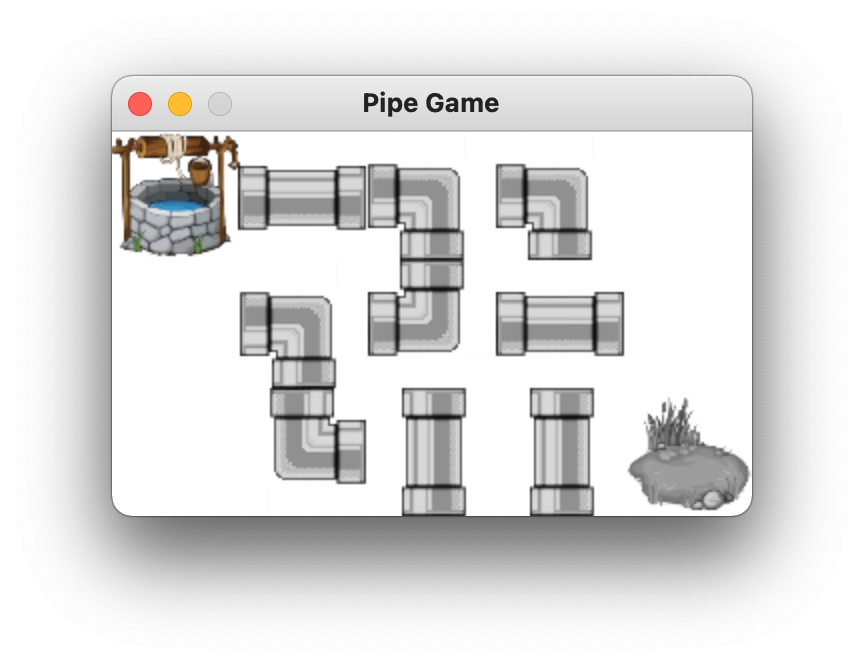

# Pipe README

## About

* これは古典的なパズルゲームの「パイプゲーム」の作り方を通してPygame ZeroとPythonを学ぶための教材です
* 綺麗な井戸（スタート地点）から村（ゴール地点）まで水が通るようにパイプを回転させるとその面のクリアーとなります

## Steps
### Step 01: pygame zeroの始まり

* Windowを出してみよう
  * `WIDTH`と`HEIGHT`を変えてみよう
* Windowの中を赤にしてみよう
  * タプルとは？`screen.fill((255, 0, 0))`のようになぜ括弧が２つあるのか？
* `print`を使ってみよう
  * `print(255, 0, 0)`と`print((255, 0, 0))`は何が違うのだろう？

### Step 02: キャラクターを表示してみよう

* Actorを1つ表示してみよう
* Actorを回転させてみよう
* Actorの位置を変えてみよう
* `draw`関数とは？
* 複数のActorを表示してみよう

### Step 03: Pythonについて

* 変数と型
  * int
  * float
  * str
* `if`構文とは？
* `for`構文とは？
* `list`（リスト）とはなんだろう？
  * listを使って複数の文字列を格納してみよう
  * `for`を使ってlistの中身を全て表示してみよう
  * index（インデックス）を使ってlistの中身を表示してみよう
  * index（インデックス）を使ってlistの中身を変更してみよう
  * 2次元listを使ってみよう
* `dictionary`（辞書とはなんだろう）？
  * dictionaryを使って複数の文字列を格納してみよう
  * `for`を使ってdictionaryの中身を全て表示してみよう
  * key（キー）を使ってlistの中身を表示してみよう
  * key（キー）を使ってlistの中身を変更してみよう
  
### Step 04: listとdictionaryを使ってActorを表示してみよう

* 複数のActorをlistに入れてみよう
* 1面のデータとなる`data`を2次元listで定義してみよう
  
```python
data = [
    [8, 1, 4, 5, 0],
    [0, 5, 6, 3, 0],
    [0, 7, 1, 1, 9],
]
```

* `data`を使って必要なActorの画像ファイルを読み込もう
  * listを使ってActorの番号と画像ファイル名を対応づけよう
  * listを使ってActorの角度も管理しよう
  ```python
  data_to_file = ['empty', 'pipe1', 'pipe1', 'pipe2', 'pipe3', 'pipe3', 'pipe3', 'pipe3', 'start', 'goal']
  data_to_angle = [0, 0, 90, 0, 0, 90, 180, 270, 0, 0]
  ```
* 十字型のパイプ`pipe4`を使用するとプログラミングが難しくなりますので、この時点では`pipe1gray`から`pipe3gray`のみを使用しましょう

### Step 05: 遊べるようにしてみよう

* クリックしたら画像が回転するようにしてみよう
  * `on_mouse_down`関数とは？
* スタート地点の井戸とゴール地点の池は回転しないようにしてみよう


### Step 06: 正解判定の準備: 再帰と幅優先探索

* Step 06と07はやや難しいです。難しい場合は飛ばしてStep08に進んでください
* Recursion （再帰）とは？
* 再帰でフィボナッチ関数を作ってみよう 
* 再帰でaのb乗を返す関数を作ってみよう 
* DFS = Depth First Search（幅優先探索）とは？
* DFSで迷路を解いてみよう

```text
##########
#S   #   #
#  # # # #
#  #   # #
#  ##### #
#    #   #
#  ### # #
#  # # ###
#    #  G#
##########
```

### Step 07: 正解判定: 幅優先探索を使った正解判定

* Step 06と07はやや難しいです。難しい場合は飛ばしてStep08に進んでください
* マウスクリックで回転したあとに正解かどうか判定しよう
* 十字型のパイプを使用すると、左右から来たのかまたは上下から来たのか次のパイプにに渡す必要があり、プログラミングが難しくなります
* ここでは十字型のパイプは使用せずに次に進みましょう
* 正解だったら`pndblue`とClearのActorを表示しよう

### Step 08: 背景画像

* Step 06/07を飛ばした人はStep 07の正解判定関数である`seikai`関数をコピーしてください
* 背景画像をつけてみよう

### Step 09: 音楽

* 音楽を鳴らしてみよう

### Step 10: 画面セレクト

* ゲームが始まる前に面セレクト画面を追加しよう

### Step 11: 面数を増やす

* 面を増やしてみよう

### Step 12: 十字型のパイプ

* 十字型のパイプを使ってみよう
  * 十字型のパイプを使用すると、左右から来たのかまたは上下から来たのか次のパイプにに渡す必要があり、DFSに一工夫必要になります

### Step 13: 緑のパイプ

* `seikai`関数が完全には正解でなかった場合でも水が通っている部分のパイプは緑のパイプに変えてみよう

### Step 14: 2つの出口

* 2又のパイプを使って出口が２つあるパズルを作成してみよう

## Note

* <https://www.istockphoto.com/jp/%E3%82%A4%E3%83%A9%E3%82%B9%E3%83%88/%E4%BA%95%E6%88%B8>よりロイヤリティフリーのイラストを使用させていただきました