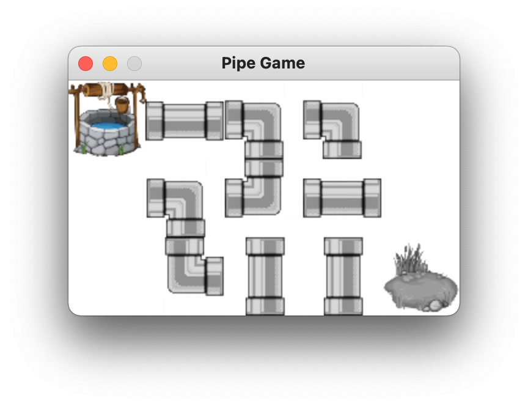

# Pipe README

## About

* これは古典的なパズルゲームの「パイプゲーム」の作り方を通してPygame ZeroとPythonを学ぶための教材です
* 綺麗な井戸（スタート地点）から村（ゴール地点）まで水が通るようにパイプを回転させるとその面のクリアーとなります

## Steps

### Step 04: listとdictionaryを使ってActorを表示してみよう

* 複数のActorをlistに入れてみよう
* 1面のデータとなる`data`を2次元listで定義してみよう

```python
data = [
    [8, 1, 4, 5, 0],
    [0, 5, 6, 3, 0],
    [0, 7, 1, 1, 9],
]
```

* `data`を使って必要なActorの画像ファイルを読み込もう
  * listを使ってActorの番号と画像ファイル名を対応づけよう
  * listを使ってActorの角度も管理しよう

```python
data_to_file = ['empty', 'pipe1gray', 'pipe1gray', 'pipe2gray', 'pipe2gray', 'pipe2gray', 'pipe2gray', 'pipe3gray', 'well', 'pondgray']
data_to_angle = [0, 0, 90, 0, 90, 180, 270, 0, 0, 0]
```

* 十字型のパイプ`pipe4`を使用するとプログラミングが難しくなりますので、この時点では`pipe1gray`か`pipe2gray`のみを使用しましょう
* 対応する`data`の番号は以下になります
  * 0: 空白
  * 1: 縦パイプ
  * 2: 横パイプ
  * 3: くの字型パイプ左と上
  * 4: くの字型パイプ左と下
  * 5: くの字型パイプ右と下
  * 6: くの字型パイプ右と上
  * 7: 十字型パイプ
  * 8: 井戸（スタート地点）
  * 9: 池（ゴール地点）

### Step 05: 遊べるようにしてみよう

* クリックしたら画像が回転するようにしてみよう
  * `on_mouse_down`関数とは？
* スタート地点の井戸とゴール地点の池は回転しないようにしてみよう


### Step 06: 正解判定の準備: 再帰と深さ優先探索

* この課題ははやや難しいです。難しい場合は飛ばしてStep08に進んでください
* Recursion （再帰）とは？
* 再帰でフィボナッチ関数を作ってみよう
* 再帰でaのb乗を返す関数を作ってみよう
* DFS = Depth First Search（深さ優先探索）とは？
* DFSで迷路を解いてみよう

```text
##########
#S   #   #
#  # # # #
#  #   # #
#  ##### #
#    #   #
#  ### # #
#  # # ###
#    #  G#
##########
```

* データを変えてゴールに辿り着けない迷路にしたらどうなるだろう？

### Step 07: 正解判定: 深さ優先探索を使った正解判定

* この課題はやや難しいです。難しい場合は飛ばしてStep08に進んでください
* マウスクリックで回転したあとに正解かどうか判定しよう
* 十字型のパイプを使用すると、左右から来たのかまたは上下から来たのか次のパイプにに渡す必要があり、プログラミングがやや難しくなります
* ここでは十字型のパイプは使用せずに次に進みましょう

### Step 08: 背景画像と水が通るパイプの背景色

* Step 06/07を飛ばした人はStep 07の正解判定関数である`dfs, can_connect, get_targets`関数を`step08.py`からコピーしてください
* 正解だったら`pondblue`と`stageclear`のActorを表示しよう
* 背景画像をつけてみよう
* この課題はやや難しいです。難しい場合は飛ばして次に進んでください。`dfs`関数が完全には正解でなかった場合でも水が通っている部分のパイプの背景色を緑にしてみよう
  * `dfs`内で接続されたパイプのlistをグローバル変数に保存しましょう
  * `screen.draw.filled_rect`が使用できます

### Step 09: 音楽

* 音楽を鳴らしてみよう

### Step 10: 画面セレクト

* ゲームが始まる前に面セレクト画面を追加しよう

### Step 11: 面数を増やす

* 面を増やしてみよう

### Step 12: 十字型のパイプ

* 十字型のパイプを使ってみよう
  * 十字型のパイプを使用すると、左右から来たのかまたは上下から来たのか次のパイプにに渡す必要があり、DFSに一工夫必要になります

## Note

* <https://www.istockphoto.com/jp/%E3%82%A4%E3%83%A9%E3%82%B9%E3%83%88/%E4%BA%95%E6%88%B8>よりロイヤリティフリーのイラストを使用させていただきました