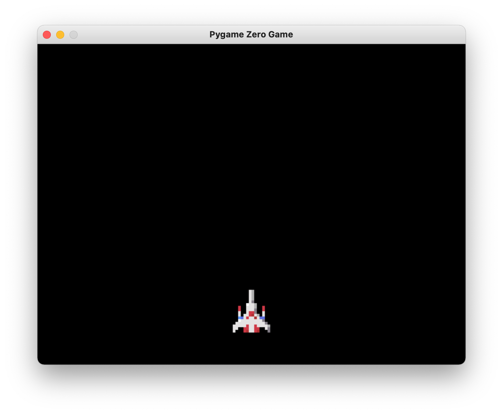
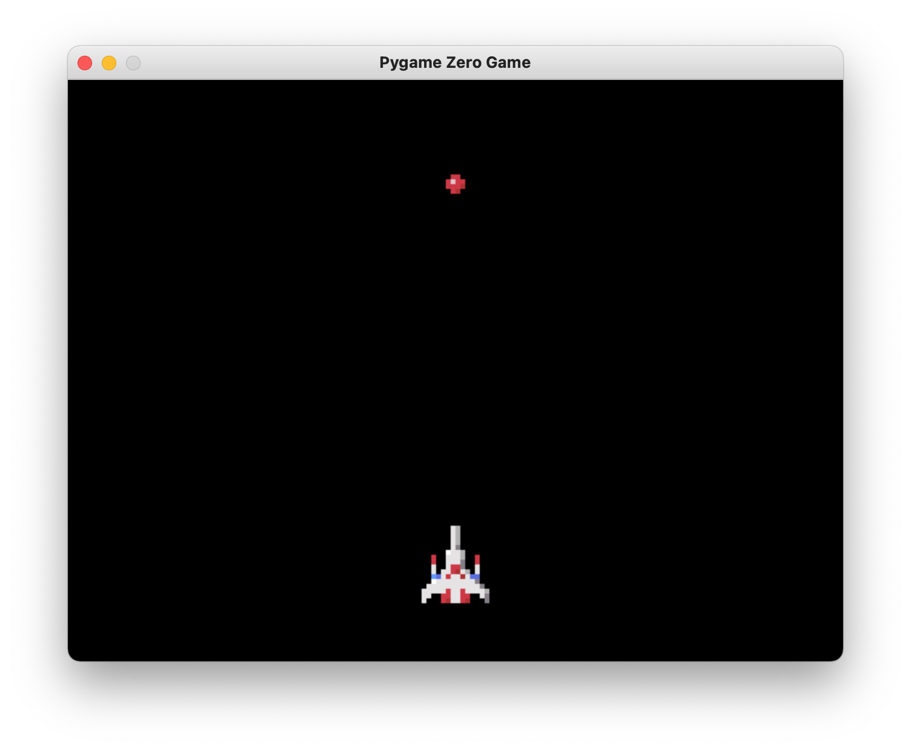
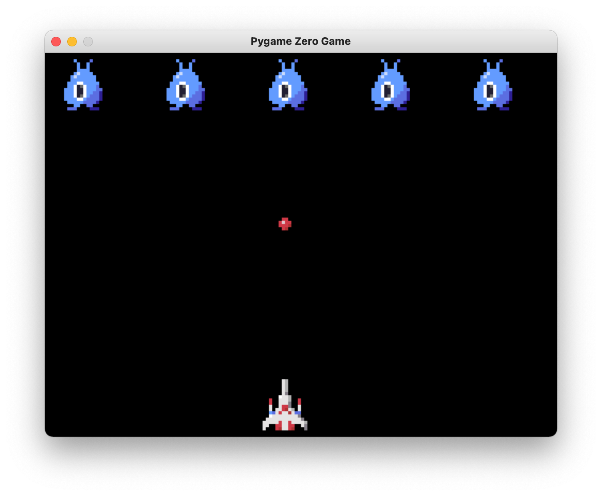
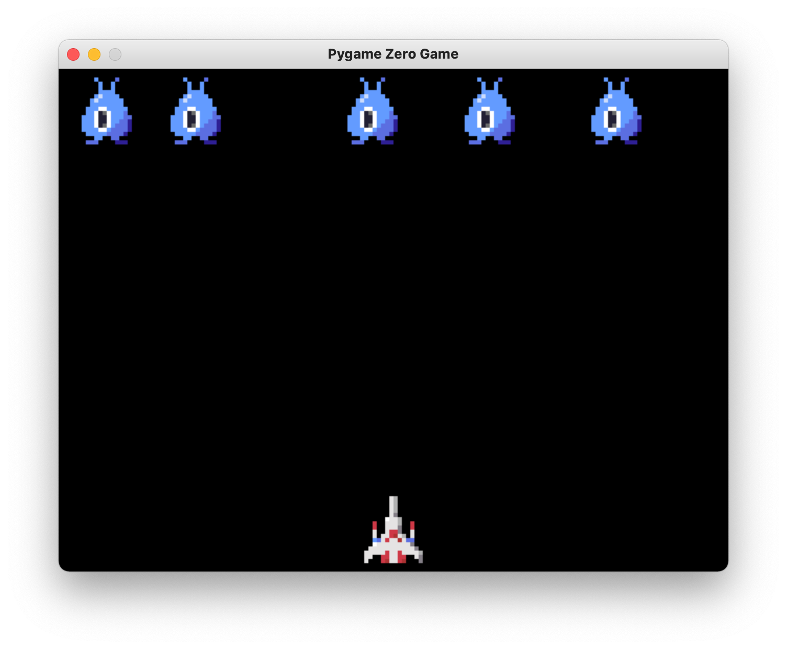
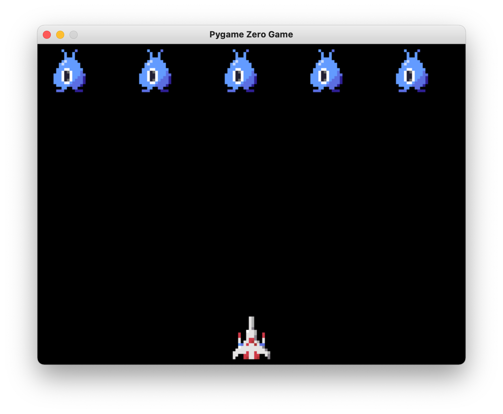
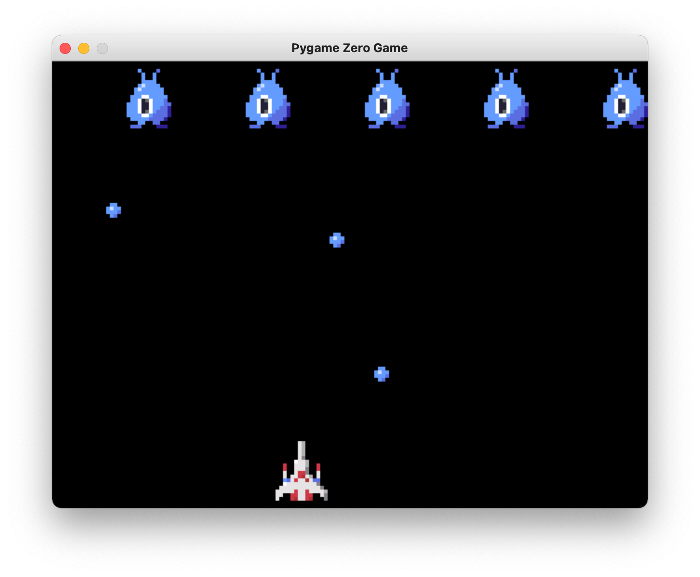
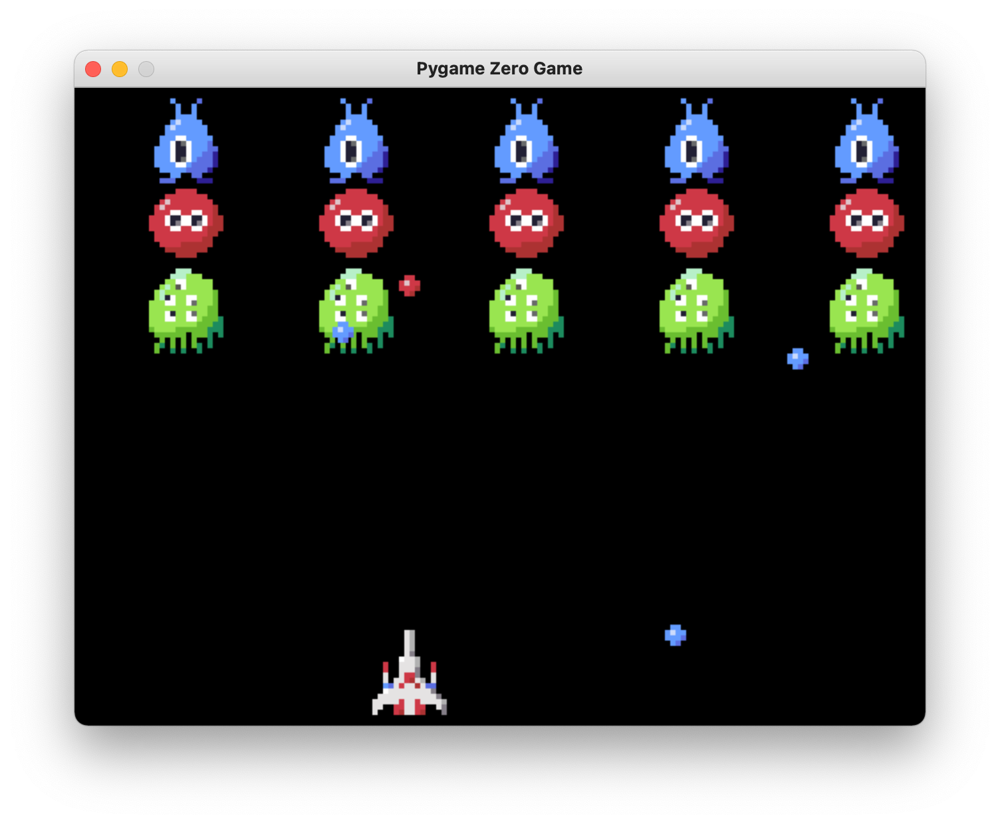
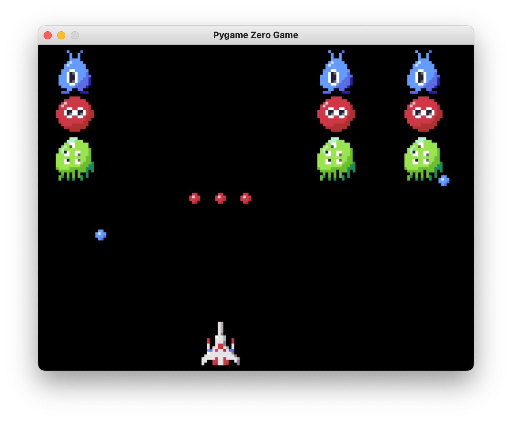
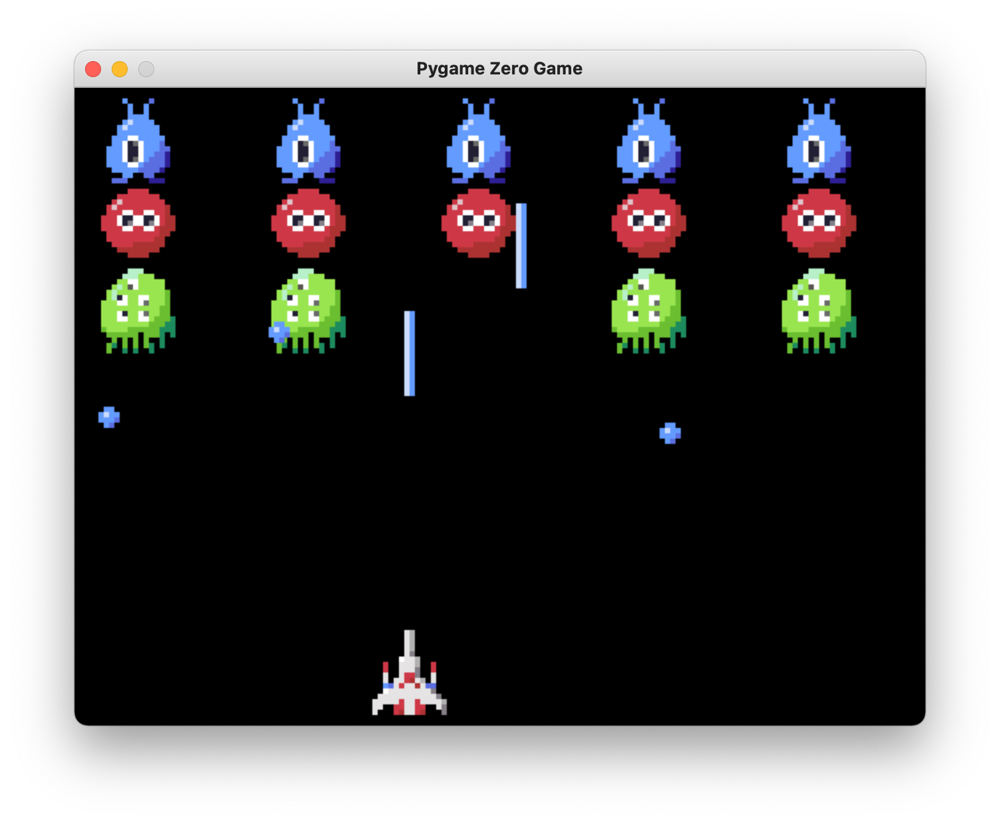

# Shooting README

## About

* これは「シューティングゲーム」の作り方を通してPygame ZeroとPythonを学ぶための教材です
* 画面上の敵を全て倒すとゲーム終了となります

## Steps

### Step 04: 自機を表示しよう

* [ここからはじめよう](../common/README.md)のStep 2と同様の手順で`images`内の`player.png`を自機として表示してみよう
* 画面サイズは幅640、高さ480にしよう
* 自機の初期表示位置は(320,400)にしよう



### Step 05: 矢印キーで自機を移動しよう

* ボタンは<https://pygame-zero.readthedocs.io/ja/latest/hooks.html>にある`on_key_down`で以下のように取得することができます
* ところが、この方法ではキーを押しっぱなしにしても`on_key_down`が呼ばれません
* キーを押しっぱなしにした時の対応は次のステップで行います

```python
def on_key_down(key):
    if key == keys.LEFT:
        player.x -= 4
    elif key == keys.RIGHT:
        player.x += 4
```

### Step 06: 矢印キー押しっぱなしに対応しよう

* キーの押しっぱなしに対応するためには、`on_key_down`と`on_key_up`を組み合わせて工夫する必要があります
* ここでは、`on_key_down`が発生したら対応するキーのグローバル変数を`True`にして、`on_key_up`では逆に`False`にすることによって今押されているかどうかを判別できるようにしましょう
* グローバル変数に書き込む関数は、最初に`global left_pressed`のように宣言する必要があります
* `update`関数は毎回描画前に呼ばれます。この関数内でグローバル変数を読んで、自機を移動させましょう

```python
left_pressed = False
right_pressed = False

def on_key_down(key):
    global left_pressed, right_pressed

    if key == keys.LEFT:
        left_pressed = True
    elif key == keys.RIGHT:
        right_pressed = True

def on_key_up(key):
    global left_pressed, right_pressed
    if key == keys.LEFT:
        left_pressed = False
    elif key == keys.RIGHT:
        right_pressed = False

def update():
    if left_pressed:
        player.x -= 4
    elif right_pressed:
        player.x += 4
```

### Step 07: 自機の移動範囲を制限して画面から出ないようにしよう

* 自機が画面から出ないように、以下の処理を追加しよう
  * 自機が画面の左端よりも左に来たら、左端に戻す
  * 自機が画面の右端よりも右に来たら、右端に戻す
* 上記を行うには、以下のように書くことができます
  * `max`を使って自機のX座標を現在の値と画面の左端のうち大きい方にする
  * `min`を使って自機のX座標を現在の値と画面の右端のうち小さい方にする

```python
    player.x = max(player.x, player.width/2)
    player.x = min(player.x, WIDTH - player.width/2)
```

### Step 08: ミサイルを発射しよう

* スペースキーでミサイルを1発だけ発射できるようにしよう
* ミサイルが画面にないときはまたミサイルが発射でき、ミサイルが画面内にあるときは発射できないようにしよう
* ミサイルが発射されたら`missile`の位置を自機の位置あたりに設定し、`draw()`内で表示されるようにしよう

```python
def fire():
    if missile.y >= -missile.height:
        print('ミサイルが画面内に存在するため、何もしません')
        return
    else:
        print('ミサイルを発射します')
        missile.x = player.x
        missile.y = player.y - missile.height

def draw():
    screen.clear()
    player.draw()
    missile.draw()
```
* ミサイルは画面の外に出たら消えるようにしよう
  
```python
def update():
    global show_missile
...
    if missile.y >= 0 - missile.height:
        missile.y -= 8
    else:
        missile.y = -100
```
* ミサイルの画像は`missile.png`を使用しよう

```python
missile = Actor('missile', pos=(0, 0))
show_missile = False
```



### Step 09: エイリアン（敵）を配置しよう

* 配列にエイリアンを格納し、表示しよう
* エイリアンとのバランスを考え、自機のY座標を440にしよう

```python
aliens = []

player = Actor('player', pos=(320, 440))

def draw():
...
    for alien in aliens:
        alien.draw()
        
def init():
    for i in range(5):
        alien = Actor('alien', pos=(64 + i * 128, 40))
        aliens.append(alien)

```

* ミサイルが当たったらエイリアンを消去しよう
* ミサイルにあったかどうかの判定はミサイルとエイリアンのx, y座標の差の絶対値が32以下の場合としよう 
  * ミサイルとエイリアンの距離`√((x1-x2)^2 + (y1-y2)^2)`で判定する場合は、そのまま計算してもいいですが、`math.dist((x1, y1), (x2, y2))`やpygame zeroの`Actor`のメソッドである`distance_to(target_actor)`が便利です
* 注意！ 配列の要素の列挙中にその配列から要素を削除してはいけません。ここでは、`aliens[:]`として`aliens`コピーを作成し、コピーアイテムをの列挙中に下の配列`aliens`から要素を削除しています
  
```python
def hit_test():
    for alien in aliens[:]:
        if hit(missile, alien):
            missile.y = -100
            show_missile = False
            aliens.remove(alien)


def hit(missile, alien):
    if show_missile and abs(missile.x - alien.x) < 32 and abs(missile.y - alien.y) < 32:
        return True
    return False
```

* ここまでのステップで少しゲームとして遊べるようになります。



### Step 10: エイリアンをランダムに動かそう

* `update()`内でエイリアンを左右にランダムに動かそう

```python
def update():
...
    for alien in aliens:
        move(alien)
    
def move(alien):
    x = random.randint(-4, 4)
    alien.x += x
    alien.x = max(alien.x, alien.width / 2)
    alien.x = min(alien.x, WIDTH - alien.width / 2)
```



### Step 11: エイリアンを規則的に動かそう

* Step10のエイリアンの動きはぎこちないです
* ここではエイリアンを右に2ドット x 30回、左に2ドット x 30回、また右に2ドット x 30回、...というように周期的に動かしましょう

```python
frame = 0


def update():
    global frame

    frame += 1
    frame %= 8000000000 # frameが大きくなりすぎたら0に戻す
    
def move(alien):
    x = 2 if frame % 60 < 30 else -2
    alien.x += x
```



### Step 12: エイリアンもミサイルを打ってくるようにしよう

   * エイリアンもミサイルを打ってくるようにしよう
     * すでに3発のミサイルがエイリアンから画面内に発射されていたらそれ以上は発射しないようにしよう
     * Step09と同様に、`alien_missiles`を巡回中にその要素を削除してはいけないので、`alien_missiles[:]`（コピー）を巡回中に`alien_missiles`の要素を削除しよう

```python
alien_missiles = []

def alien_fire(alien):
    global alien_missiles
    if len(alien_missiles) >= 3:
        return
    missile = Actor('alien_missile', pos=(alien.x, alien.y + alien.height/2))
    alien_missiles.append(missile)

def update():
...
    for alien_missile in alien_missiles[:]:
        alien_missile.y += 4
        if alien_missile.y >= HEIGHT + alien_missile.height / 2:
            alien_missiles.remove(alien_missile)
            
def draw():
...
    for alien_missile in alien_missiles:
        alien_missile.draw()
```



### Step 13: エイリアンの種類を増やそう

  * 青いイリアンの下に赤いエイリアンの列、その下に緑のエイリアンの列を作ろう

```python
def init():
    for j in range(3):
        for i in range(5):
            if j==0:
                alien = Actor('alien1', pos=(48 + i * 128, 40))
            elif j==1:
                alien = Actor('alien2', pos=(48 + i * 128, 104))
            else:
                alien = Actor('alien3', pos=(48 + i * 128, 168))
            aliens.append(alien)
```



### Step 14: ゲームクリア/ゲームオーバー

  * エイリアンを全て倒したら`Clear`と表示しよう
  * エイリアンのミサイルに自機が当たったら`Game Over`と表示しよう
  * ゲームクリアもしくはゲームオーバーを3秒表示したら自動的にゲームを再開しよう

### Step 15: ミサイルを画面内3発まで発射できるようにしよう

  * 配列を使用してミサイルを画面内3発まで発射できるようにしよう

```python
missiles = []

def update():
...
        for missile in missiles[:]:
            if missile.y >= 0 - missile.height:
                missile.y -= 8
            else:
                missiles.remove(missile)

def fire():
    if len(missiles) >= 3:
        print('ミサイルが画面内に多数存在するため、何もしません')
        return
    else:
        print('ミサイルを発射します')
        missile = Actor('missile', pos=(player.x, player.y))
        missile.y -= missile.height;
        missiles.append(missile)

def hit_test():
    global gameover

    for alien in aliens[:]:
        for missile in missiles[:]:
            if hit(missile, alien):
                aliens.remove(alien)
                missiles.remove(missile)

```

### Step 16: Zキーで3-wayミサイルを発射できるようにしよう

  * `Actor`には自由にプロパティを持たせることができます
  * ここでは、`missile`に`dx`と`dy`というプロパティを持たせ、その数値だけ`update`の際に動かすようにしましょう
　* 3-wayの左方向、中央、右方向に進むミサイルの`dx`, `dy`を以下のようにします
    * 左 dx=-2, dy=-8
    * 中央 dx=0, dy=-8
    * 右 dx=2, dy=-8
    
```python
def on_key_down(key):
    global left_pressed, right_pressed
    print(key)
    if key == keys.LEFT:
        left_pressed = True
...
    elif key == keys.Z:
        fire_3way()

def fire_3way():
    if len(missiles) >= 1:
        print('ミサイルが画面内に多数存在するため、何もしません')
        return
    else:
        print('3-way ミサイルを発射します')
        for dx in (-2, 0, 2):
            missile = Actor('missile', pos=(player.x, player.y))
            missile.y -= missile.height
            missile.dy = -8
            missile.dx = dx
            missiles.append(missile)

def hit_test():
    global gameover

    for alien in aliens[:]:
        for missile in missiles[:]:
            # alienはすでにaliensから削除されている可能性があるので、まだ削除されていないかチェックした後hittest, removeする
            if alien in aliens and hit(missile, alien):
                aliens.remove(alien)
                missiles.remove(missile)
```



### Step 17: Xキーでレーザーを発射できるようにしよう

* `fire_laser`でレーザーを白差する際、ミサイルのプロパティに`laser`をセットします
* 値は何でも構いませんが、今回は`True`にします
* `hit_test`でミサイル・レーザーがエイリアンに当たった際に`missile`が`laser`プロパティを持っていたら、`missile`を削除しないようにします

```python
def on_key_down(key):
    global left_pressed, right_pressed
    print(key)
    if key == keys.LEFT:
        left_pressed = True
...
    elif key == keys.X:
        fire_laser()
        
        
def fire_laser():
    if len(missiles) >= 3:
        print('ミサイルが画面内に多数存在するため、何もしません')
        return
    else:
        print('レーザーを発射します')
        missile = Actor('laser', pos=(player.x, player.y))
        missile.y -= missile.height
        missile.dy = -8
        missile.dx = 0
        missile.laser = True
        missiles.append(missile)


def hit_test():
    global gameover

    for alien in aliens[:]:
        for missile in missiles[:]:
            # alienはすでにaliensから削除されている可能性があるので、まだ削除されていないかチェックした後hittest, removeする
            if alien in aliens and hit(missile, alien):
                aliens.remove(alien)
                if not hasattr(missile, 'laser'):
                    missiles.remove(missile)
```



## さらに改良するには？

* 右上にスコアを表示しましょう
* いきなりゲームが始まるのではなく、タイトル画面をつけるにはどうしたら良いでしょう
* どうやったらエイリアンを回転できるか調べてみましょう
  * [Pygame Zeroのページ](https://pygame-zero.readthedocs.io/ja/latest/hooks.html)に、イベントのフックや組み込みオブジェクトについて解説があります
  * さらに詳しい情報を得るためには、[Pygame Zeroのソースコード](https://github.com/lordmauve/pgzero)を読む必要があります
  * 例えば、Actorの持つメソッドは[こちら](https://github.com/lordmauve/pgzero/blob/master/pgzero/actor.py)に書かれています
* どうやったらエイリアンや自機をアニメーションできるか調べてみましょう
